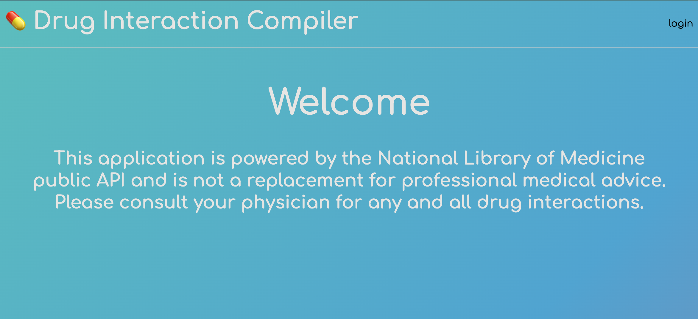
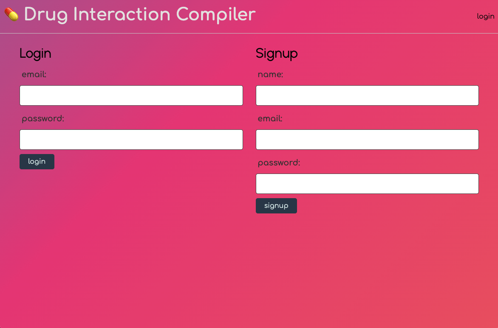
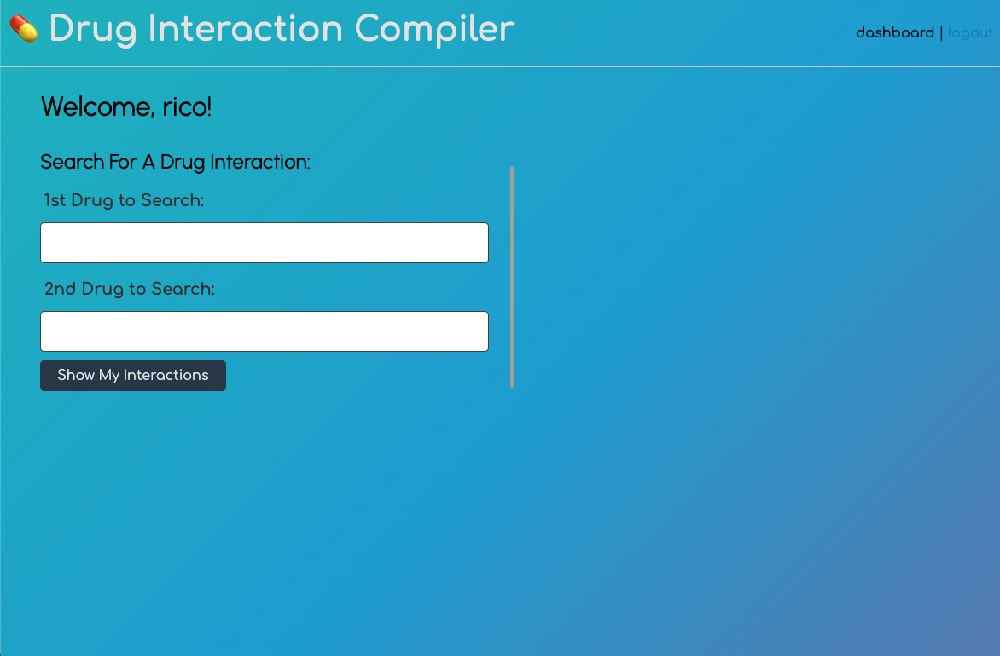

# My-interactions

This application allows users to create profiles to research and store drug interactions behind a secure and personal login.

## User Story

As a user I want to see if the drugs and supplements that I take, or could take, will have interactions with one another drug. As a private individual I would like to know the results of my search privately and not on a public browser's search. I would also like to reference back to my previous inputs and store them to my account.

## Functionality: How-to-Use

1. Go to page link: https://my-interactions.herokuapp.com
2. Select "login" on the top right
3. Create a new account by supplying your name, email, and password.
4. Once you have created account it will bringly directly to your dashboard page.
5. On the dashboard page you will type in the first drug in the "1st drug to search".
6. Then you will type in the second drug that you would likecheck for interactions against in the "2nd Drug to Search" field.
7. Click "Show My Interactions" and wait for your results below!
8. Simply "Logout" to end your session in the top right.

https://my-interactions.herokuapp.com

## Images and Presentation

## Links to images and presentation

https://docs.google.com/presentation/d/1aOLSsxHr0D_m7Z47QRcPrpww-8N1pkQDIoR7ipgdw1c/edit#slide=id.g102f0629112_0_20

## HOME PAGE

## LOG-IN PAGE

## DASHBOARD

# Courtesy of: Rico, Anthony, Chris, and David

# License

MIT License

Copyright (c) [2021] [My-interactions]
Permission is hereby granted, free of charge, to any person obtaining a copy of this software and associated documentation files (the "Software"), to deal in the Software without restriction, including without limitation the rights to use, copy, modify, merge, publish, distribute, sublicense, and/or sell copies of the Software, and to permit persons to whom the Software is furnished to do so, subject to the following conditions:

The above copyright notice and this permission notice shall be included in all copies or substantial portions of the Software.

THE SOFTWARE IS PROVIDED "AS IS", WITHOUT WARRANTY OF ANY KIND, EXPRESS OR IMPLIED, INCLUDING BUT NOT LIMITED TO THE WARRANTIES OF MERCHANTABILITY, FITNESS FOR A PARTICULAR PURPOSE AND NONINFRINGEMENT. IN NO EVENT SHALL THE AUTHORS OR COPYRIGHT HOLDERS BE LIABLE FOR ANY CLAIM, DAMAGES OR OTHER LIABILITY, WHETHER IN AN ACTION OF CONTRACT, TORT OR OTHERWISE, ARISING FROM, OUT OF OR IN CONNECTION WITH THE SOFTWARE OR THE USE OR OTHER DEALINGS IN THE SOFTWARE.
